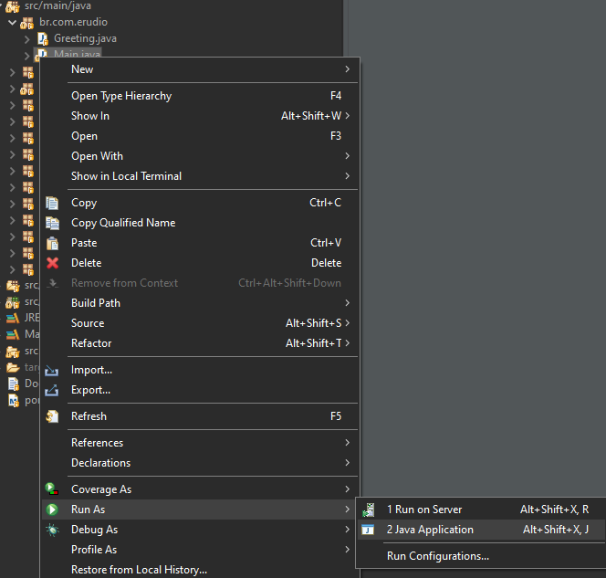

# Spring Boot 2.1.3
## Curso Udemy - REST API's RESTFul do 0 à AWS With Spring Boot 2.x e Docker


This project can be used as a base implementation for other API's.

## Content:
   * Implementation of DTO's
   * API versioning
   * Migrations with Flyway
   * Content Negotioation (Json, XML, YAML)
   * Implementation of Hateoas
   * Swagger support
   * Authentication with JWT and Spring Security
   * Integration with Travis CI and docker-compose
   * Configuration for CORS
   * Pagination
   * Upload Files

## Requirements for development environment:
* Java 11
* Apache Maven 3.6.3
* Postgres
* Eclipse (20-09)

## Setup

To run on Eclipse it is necessary to adjust the database settings in the directory  ```src/main/resources/application.properties```, change the following lines:
```sh
spring.datasource.url= jdbc:postgresql://URL_DB:PORT_DB/NAME_DB
spring.datasource.username=USER_DB
spring.datasource.password=PASSWORD_DB
```

Also, change Flyway credentials in the pom.xml file

```sh

<configuration>
  <url>jdbc:postgresql://URL_DB:PORT_DB/NAME_DB?useTimezone=true&amp;serverTimezone=UTC&amp;useSSL=false</url>
  <user>USER_DB</user>
  <password>PASSWORD_DB</password>
</configuration>
```


Now just run Main.java as: Run as -> Java Application.




## Requirements for production environment:
* Java 11
* Apache Maven 3.6.3
* Docker-Compose

## Production setup
Access the directory of ```docker-compose.yml``` and exec the command ```sudo docker-compose up```

## Meta

Ronaldo Almeida – [Linkedin](https://www.linkedin.com/in/ronaldo-almeida-9a8a8316b/) – ronaldoalm1812@edu.unifor.br

[https://github.com/ronaldoalm](https://github.com/ronaldoalm)
